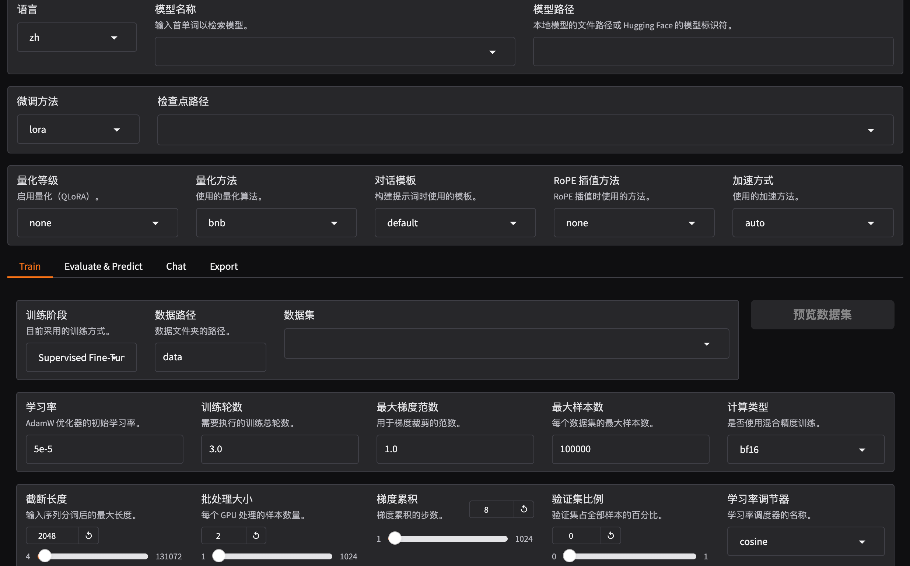
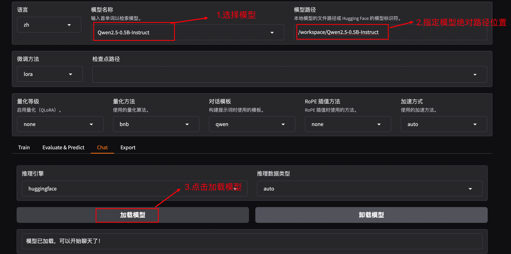
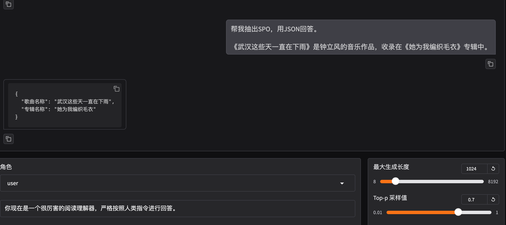
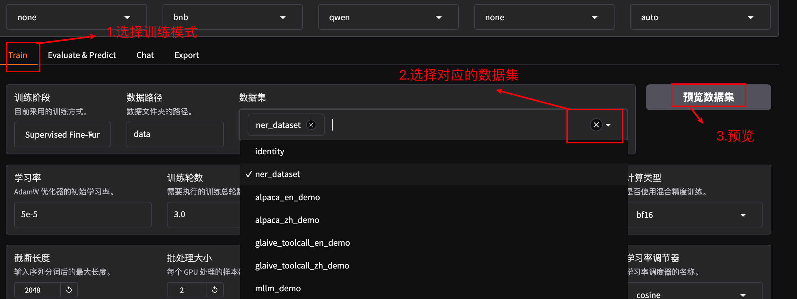
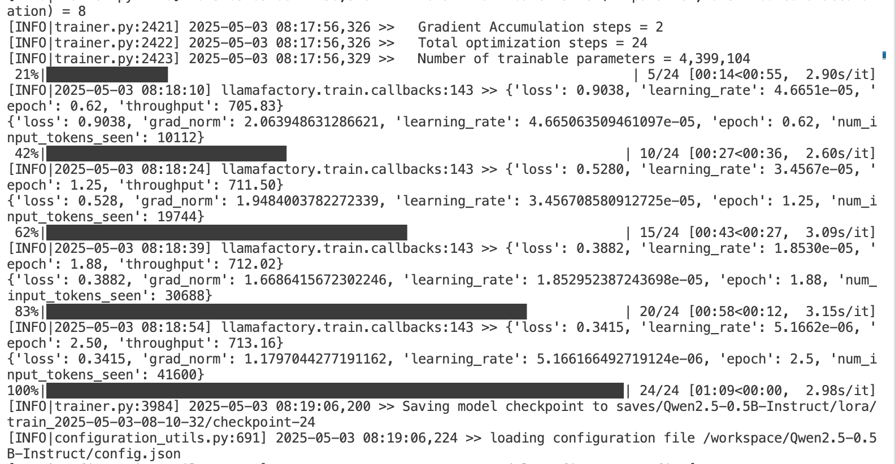
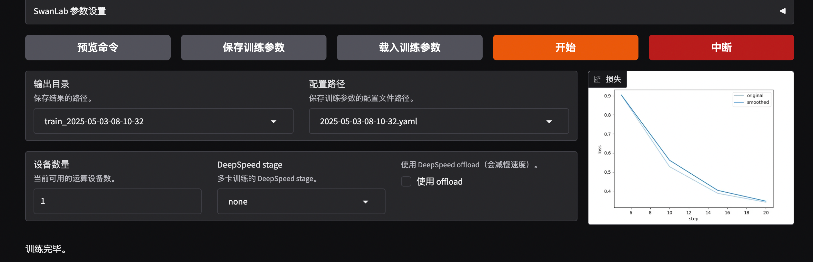
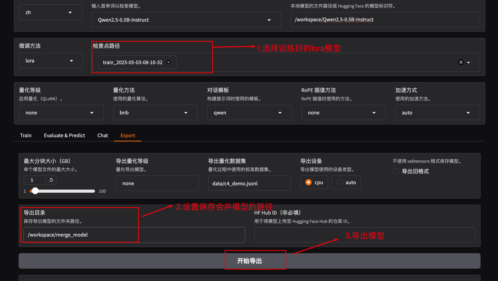
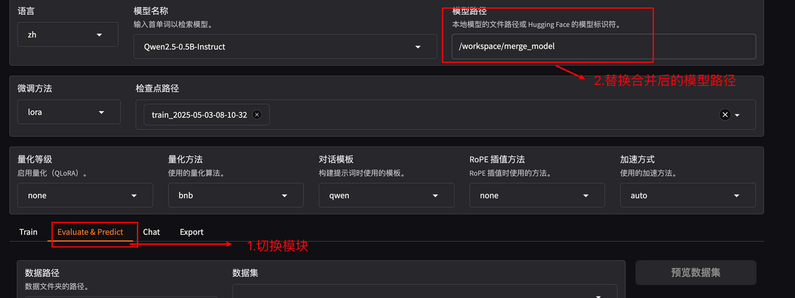
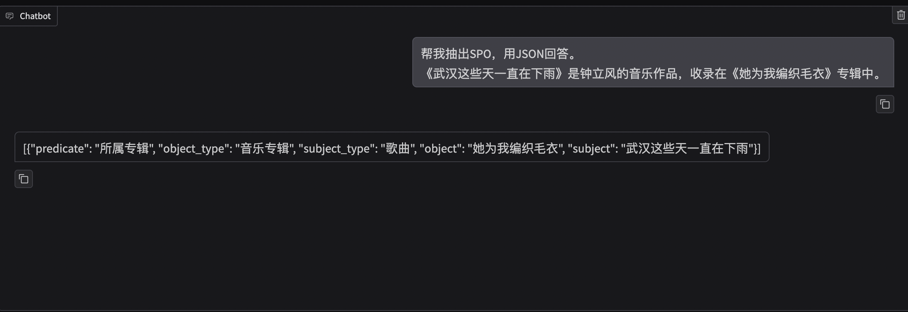

# 基于LLaMA-Factory实现大模型微调

以Qwen2.5-0.5b-Instruct 模型和 Linux +T4 16GB 环境为例，重点介绍 LoRA + SFT（监督微调）训练阶段的常见功能。

------

## 1. LLaMA-Factory基本介绍

LLaMA-Factory 是一个整合主流高效训练微调技术的框架，适配多种开源大模型（如 LLaMA、Qwen、Baichuan 等），提供丰富的功能接口和基于 Gradio 的网页工作台，帮助开发者快速构建定制化模型。主要特点包括：

- **多阶段训练**：支持预训练（PT）、监督微调（SFT）、基于人工反馈的对齐（RLHF）等。
- **高层次接口**：包括训练、推理、评测、API 服务等功能。
- **易用性**：提供 WebUI 界面，降低初学者使用门槛。
- **高效微调**：支持 LoRA 等高效微调技术，降低显存和算力需求。

本教程目标是通过实践以下功能，帮助开发者快速掌握 LLaMA-Factory 的使用：

1. 原始模型直接推理
2. 自定义数据集构建
3. 基于 LoRA 的 SFT 指令微调
4. 动态合并 LoRA 的推理
5. LoRA 模型合并导出
6. 导出 GGUF 格式并使用 Ollama 推理

------

## 2. Llama-Factory的安装与使用

### 2.1 Llama-Factory的安装

- **腾讯云地址**：https://cloudstudio.net/

- **硬件要求**：建议使用T4、RTX 3090 或 4090（16GB 显存）以支持 1.5B 模型训练。
- **显卡驱动和 CUDA**：

  - 运行 `nvidia-smi` 检查 GPU 状态和配置。
  - 确保显卡驱动和 CUDA 已正确安装
  
- **安装步骤**：

  ```bash
  git clone https://github.com/hiyouga/LLaMA-Factory.git
  # 如果自己想创建虚拟环境，就按照下面的conda命令操作，也可以省略该步骤
  # conda create -n llama_factory python=3.10 (可不操作)
  # conda activate llama_factory (可不操作)
  cd LLaMA-Factory
  pip install -e '.[torch,metrics]'
  ```

### 2.2 Llama-Factory的使用

- **终端输入**

  ```bash
  1. cd LLaMA-Factory 
  2. llamafactory-cli webui
  llamafactory-cli webui --theme default
  ```

- 成功运行后会出现以下信息，连接浏览器打开便是 LLaMA-Factory 的界面

  ```bash
  * Running on local URL:  http://0.0.0.0:7860
  ```

- 界面成功显示：

  

### 2.3 常用参数说明

- **语言**

  - 英语不好选中文 zh 即可

    ```properties
    en: 英语
    ru: 俄语
    zh: 中文
    ko: 韩语
    ja: 日文
    ```

- 模型名称和模型路径

  ```properties
  模型名称: 待训练的模型名称，因为每个大模型能够接受的提示词模板都是固定的，修改此参数【对话模版】参数也会自动匹配。
  模型路径: 支持huggingface在线路径，或者本地的模型路径（注意是绝对路径）
  ```

- 微调方法和检查点路径

  - 微调方法

    ```properties
    full: 全量微调，就是所有权重都进行训练。
    freeze: 冻结微调，只训练部分层，其它层的权重进行冻结，也就是不进行训练。
    lora:目前众多微调方法中，最常用，也是相对来说效果比较好的微调方法之一。有类似需要的计算资源少，计算效率高，不改变原始模型结构等等的优点。
    ```

  - 检查点路径

    ```properties
    检查点路径在长时间训练大模型的时候会经常用，主要作用是把训练过程中的阶段性结果进行保存，这里是设置指定的保存地址的。这样如果训练过程意外中断，可以从检查点开始继续训练，不用从头再开始训练。若不设置，则默认保存在 LLaMA-Factory 的 /saves文件中
    ```

## 3 基于Qwen模型进行微调

本次以Qwen2.5-0.5b-Instruct 模型为例，微调该模型以实现针对泛娱乐数据集中的"信息抽取功能"，目标掌握 LoRA + SFT（监督微调）训练模型和应用的完整实现过程。

### 3.1 模型下载与初体验

- **下载Qwen2.5-0.5b-Instruct** ：

  - ModelScope（适合中国大陆）：

    ```bash
    第一步：pip install modelscope
    第二步：modelscope download --model Qwen/Qwen2.5-0.5B-Instruct
    移动模型路径：mv /root/.cache/modelscope/hub/models/Qwen/Qwen2.5-0.5B-Instruct .
    ```

- **模型初体验**：

  微调前可以加载模型进入chat模式，看模型能否正常加载。

  

  聊天展示：

  

> 从结果上看，目前该模型还不具备信息抽取的功能

### 3.2 数据集准备

LLaMA-Factory 支持 `alpaca` 数据格式，以下以 SFT 阶段的 `alpaca` 格式为例。

#### 3.2.1 数据格式

`alpaca` 格式为 JSON 对象的列表：

```json
[
  {
    "instruction": "用户指令（必填）",
    "input": "用户输入（选填）",
    "output": "模型回答（必填）",
    "system": "系统提示词（选填）",
    "history": [
      ["第一轮指令（选填）", "第一轮回答（选填）"],
      ["第二轮指令（选填）", "第二轮回答（选填）"]
    ]
  }
]

```

- **单轮对话示例**（`alpaca_zh` 数据集）：

  ```json
  {
    "instruction": "写一个有效的比较语句",
    "input": "篮球和足球",
    "output": "篮球和足球都是受欢迎的运动。"
  }
  
  ```

- **多轮对话示例**（`oaast_sft_zh` 数据集）：

  ```json
  {
    "instruction": "谢谢",
    "input": "",
    "output": "不用谢! 很高兴我提供的信息能够帮助到你! 如果还有什么其他问题也可以向我提问。",
    "history": [
      [
        "请你给我写一个面试准备计划，我想要去面试微软的程序员岗位",
        "首先，你可以去微软官网寻找招聘信息并申请面试。\n其次，您可以在社交媒体平台寻找微软公司对程序员的面试问题，并做好准备。\n最后，您可以自己对面试过程进行模拟，熟悉话题并减少紧张感。\n我希望你能面试成功。"
      ]
    ]
  }
  ```

#### 3.2.2 数据集注册

数据集需在 `data/dataset_info.json` 中注册，指定数据集名称、文件路径及字段映射。

自定义信息抽取的数据集

- **原始数据**：

  ```json
      {
          "instruction": "你现在是一个很厉害的阅读理解器，严格按照人类指令进行回答。",
          "input": "句子中包含了哪些信息，输出json：\n\n白胸三刺角蝉是属于同翅目的一种动物。",
          "output": "[{\"predicate\": \"目\", \"object_type\": \"目\", \"subject_type\": \"生物\", \"object\": \"同翅目\", \"subject\": \"白胸三刺角蝉\"}]"
      },
  ```

- **操作步骤**：

  1. 将数据集(上传)复制到 `data/` 目录。

  2. 在 `data/dataset_info.json` 中注册：

     ```json
       "ner_dataset": {
         "file_name": "ner_dataset.json"
       },
     ```

------

### 3.3 基于 LoRA 的微调模型

注意：整个过程都基于上述运行的llama-factory的webui界面操作

目标：让 Qwen2.5-0.5B-Instruct 模型学习 `identity` 数据集的身份认知和 `ner_dataset` 数据集的信息抽取能力。

#### 3.3.1 选择数据集

选择Train模式，选择数据集，进行数据集的预览



#### 3.3.2 配置训练参数

可以默认选择参数，也可以灵活调整，选择参数完毕之后，可以点击预览命令查看执行命令，注意，因为数据量较少，为了模型实现较好的结果，epoch选择多的轮次，比如：15轮。

```bash
llamafactory-cli train \
    --stage sft \
    --do_train True \
    --model_name_or_path /workspace/Qwen2.5-0.5B-Instruct \
    --preprocessing_num_workers 16 \
    --finetuning_type lora \
    --template qwen \
    --flash_attn auto \
    --dataset_dir data \
    --dataset ner_dataset \
    --cutoff_len 2048 \
    --learning_rate 5e-05 \
    --num_train_epochs 3.0 \
    --max_samples 100000 \
    --per_device_train_batch_size 4 \
    --gradient_accumulation_steps 2 \
    --lr_scheduler_type cosine \
    --max_grad_norm 1.0 \
    --logging_steps 5 \
    --save_steps 100 \
    --warmup_steps 0 \
    --packing False \
    --report_to none \
    --output_dir saves/Qwen2.5-0.5B-Instruct/lora/train_2025-05-03-08-10-32 \
    --bf16 True \
    --plot_loss True \
    --trust_remote_code True \
    --ddp_timeout 180000000 \
    --include_num_input_tokens_seen True \
    --optim adamw_torch \
    --lora_rank 8 \
    --lora_alpha 16 \
    --lora_dropout 0 \
    --lora_target all
```

#### 3.3.3 关键参数说明

| 参数名称                      | 说明                                                  |
| ----------------------------- | ----------------------------------------------------- |
| `stage`                       | 训练阶段，`sft` 表示监督微调。                        |
| `do_train`                    | 启用训练模式。                                        |
| `dataset`                     | 数据集列表，多个数据集用逗号分隔。                    |
| `dataset_dir`                 | 数据集目录（如 `./data`）。                           |
| `finetuning_type`             | 微调类型，`lora` 表示使用 LoRA 技术。                 |
| `output_dir`                  | 训练结果保存路径。                                    |
| `cutoff_len`                  | 数据集长度截断。                                      |
| `per_device_train_batch_size` | 每设备训练批次大小，显存足够可适当增加。              |
| `fp16`                        | 启用半精度训练（注意：老显卡如 V100 不支持 `bf16`）。 |
| `max_samples`                 | 每个数据集的最大采样数量。                            |
| `val_size`                    | 验证集比例。                                          |

#### 3.3.4 训练模型

- **点击"开始”按钮**，就可以实现模型的训练，服务器终端会显示训练的过程：



- **保存内容**（在 `output_dir` 下）：

  - `adapter*`：LoRA 模型权重。
  - `training_loss`、`trainer_log`：训练过程中的损失和日志。
  - 其他：训练参数备份。

- **Loss 趋势**：训练过程中 Loss 应逐渐下降，理想情况下降至 1 以下。

- **训练完毕后**：web界面展示

  

------

## 4 模型合并与验证

在训练完成后，使用 WebUI 验证 LoRA 模型效果。

### 4.1 合并模型

切换至 Export ，按照下面步骤，即可导出

- 1. 选择之前训练过程中保存模型的路径
  2. 自定义合并后模型保存的路径
  3. 导出模型



### 4.1 WebUI 实现模型推理

依然切换至Chat这个模块对模型进行测试,但是需要将模型路径改为：合并之后的模型绝对路径位置



示例：

```text
你现在是一个很厉害的阅读理解器，严格按照人类指令进行回答。
帮我抽出SPO，用JSON回答。
《武汉这些天一直在下雨》是钟立风的音乐作品，收录在《她为我编织毛衣》专辑中。
```

- 结果展示



------

## 5. 导出 GGUF 格式并使用 Ollama 推理（扩展）

将模型转换为 GGUF 格式并部署到 Ollama。

### 步骤

1. **安装 GGUF 库**：

   ```bash
   git clone https://github.com/ggerganov/llama.cpp.git
   cd llama.cpp/gguf-py
   pip install --editable .
   ```

2. **格式转换**：

   ```bash
   cd ..
   python convert-hf-to-gguf.py /workspace/java_87
   ```

   输出：GGUF 文件。

3. **安装 Ollama**：

   ```bash
   curl -fsSL https://ollama.com/install.sh | sh
   ```

4. **注册模型**：

   ```bash
   ollama create chat-merged -f /workspace/java_87
   ```

5. **启动服务**：

   ```bash
   ollama run chat-merged
   ```

   - 交互式问答，输入 `/bye` 退出。

